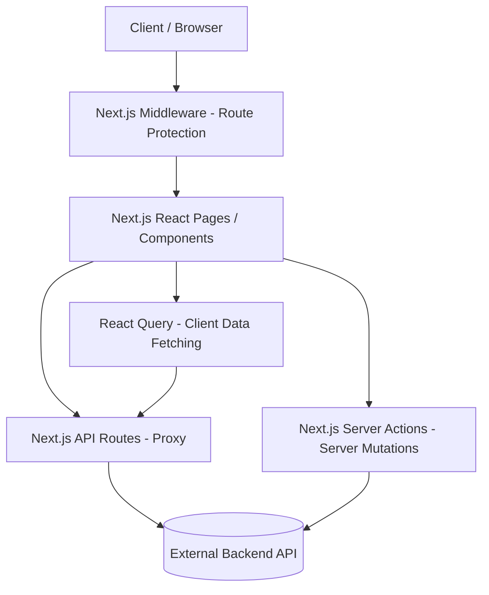

Viewed use-diplomas-filters.ts:1-39

# Exam App

A modern web application for managing and taking online exams and diploma programs.

## Overview

This project is a comprehensive frontend application built with Next.js (App Router), React, and TypeScript. It serves as a platform for both administrators and students. Administrators can create and manage diplomas, exams, and questions, while students can browse available diplomas, take exams, and track their performance. The application interfaces with an external backend API and utilizes Next.js API routes and Server Actions for secure communication and data fetching.

## Features

### Authentication

- Registration with multi-step flow (Email verification, OTP confirmation, User Details)
- Login via Credentials
- Password Reset & Forgot Password flows
- Role-based Access Control (Admin vs. User)

### Diplomas

- Browse available diploma programs
- Admin: Create, update, delete, and manage diploma immutability
- View diploma details and associated exams

### Exams & Questions

- Take exams and submit answers
- Admin: Create, update, and delete exams
- Admin: Manage exam questions (Create, Update, Delete)

### User Account

- View and update profile information
- Change email address (with OTP confirmation)
- Change password
- Delete account

## Tech Stack

- **Framework:** Next.js 16 (App Router)
- **Language:** TypeScript
- **Styling:** Tailwind CSS v4, shadcn/ui (Radix UI)
- **Data Fetching & State:** React Query (TanStack Query v5), Next.js Server Actions
- **Form Handling & Validation:** React Hook Form, Zod
- **Authentication:** NextAuth.js (JWT strategy)
- **Icons:** Lucide React

## Architecture

The application follows a Feature-Sliced Design architecture to maintain modularity and scalability. It acts as a Frontend and Backend-For-Frontend (BFF), communicating securely with an external API.



## Project Structure

```text
src/
├── app/                  # Next.js App Router pages, layouts, and API routes
│   ├── (auth)/           # Authentication route group (Login, Register, etc.)
│   ├── (main)/           # Main application route group (Diplomas, Exams, Dashboard)
│   └── api/              # Next.js API route handlers (BFF layer)
├── features/             # Feature-sliced domain modules
│   ├── auth/             # Authentication logic, schemas, and components
│   ├── dashboard/        # Dashboard layout and core components
│   ├── diplomas/         # Diploma management and listing
│   ├── exams/            # Exam taking and management
│   ├── questions/        # Question management
│   └── users/            # User profile management
└── shared/               # Shared utilities, components, and configurations
    ├── components/       # Global UI components (shadcn/ui, form fields)
    ├── hooks/            # Global custom React hooks
    ├── lib/              # Global utilities, types, and constants
    └── providers/        # React context providers (Query, Auth, Tooltip)
```

## Prerequisites

- Node.js (version 20 or higher recommended)
- npm (Package manager)

## Installation

1. Clone the repository:

   ```bash
   git clone https://github.com/Mahmoudramadan21/exam-app.git
   cd exam-app
   ```

2. Install dependencies:

   ```bash
   npm install
   ```

3. Set up environment variables:
   Create a `.env` file in the root directory based on the required variables below.

## Environment Variables

Create a `.env` file in the root directory with the following variables:

| Variable                  | Required | Purpose                                             |
| ------------------------- | -------- | --------------------------------------------------- |
| `NEXT_PUBLIC_BASE_URL`    | Yes      | Base URL for the frontend application               |
| `NEXT_PUBLIC_APP_URL`     | Yes      | App URL for redirection flows                       |
| `NEXTAUTH_URL`            | Yes      | URL for NextAuth.js configuration                   |
| `NEXTAUTH_SECRET`         | Yes      | Secret key used by NextAuth to encrypt JWT tokens   |
| `BACKEND_URL`             | Yes      | Server-side URL of the external backend API         |
| `NEXT_PUBLIC_BACKEND_URL` | Yes      | Client-side exposed URL of the external backend API |

## Available Scripts

| Command         | Description                           |
| --------------- | ------------------------------------- |
| `npm run dev`   | Starts the Next.js development server |
| `npm run build` | Builds the application for production |
| `npm run start` | Starts the production server          |
| `npm run lint`  | Runs ESLint for code linting          |

## API

The application interacts with an external backend API. Next.js API Routes (`src/app/api`) are utilized as a proxy to handle requests securely, extract the JWT token from the NextAuth session, and forward the request to the external backend.

Key Next.js API Routes include:

| Method | Endpoint             | Description                                  | Authentication   |
| ------ | -------------------- | -------------------------------------------- | ---------------- |
| POST   | `/api/upload-image`  | Uploads an image via FormData to the backend | Required         |
| GET    | `/api/diplomas`      | Fetches a paginated list of diplomas         | Required         |
| POST   | `/api/diplomas`      | Creates a new diploma                        | Required (Admin) |
| GET    | `/api/diplomas/[id]` | Fetches details of a specific diploma        | Required         |
| GET    | `/api/exams`         | Fetches a paginated list of exams            | Required         |
| POST   | `/api/questions`     | Creates a new question for an exam           | Required (Admin) |

## Authentication

Authentication is handled using **NextAuth.js** with a Credentials provider.

- **Strategy:** Sessions are managed securely via JWT tokens instead of database sessions.
- **Flow:** The NextAuth configuration intercepts the login payload, validates it using Zod schemas, and authenticates against the external backend API. Upon successful authentication, the backend JWT token and user details are persisted in the NextAuth JWT token and mapped to the client session.
- **Route Protection:** Role-based access control is enforced via Next.js Middleware (`src/proxy.ts`). The middleware intercepts requests, checks for a valid session token, and validates user roles (`ADMIN` vs `USER`) against predefined route patterns (`ROUTES.admin`, `ROUTES.user`, `ROUTES.auth`). Unauthenticated users are redirected to the login page.

## Deployment

This application is a standard Next.js project and can be deployed to any Node.js hosting environment, with platforms like Vercel being highly recommended.

1. Ensure all required environment variables are set in your deployment platform's configuration settings.
2. The deployment build command is `npm run build`.
3. The production start command is `npm run start`.
